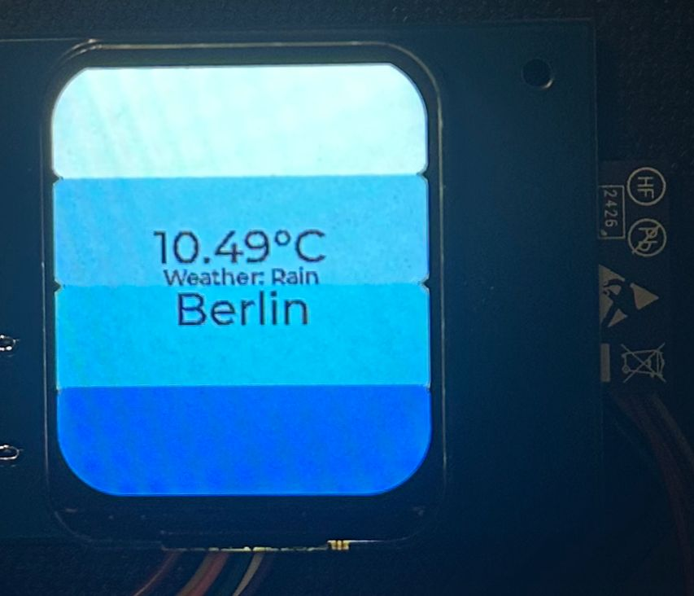
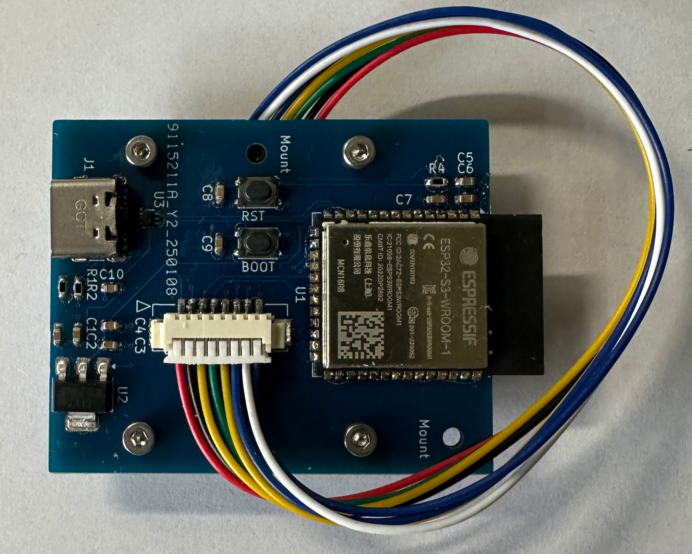
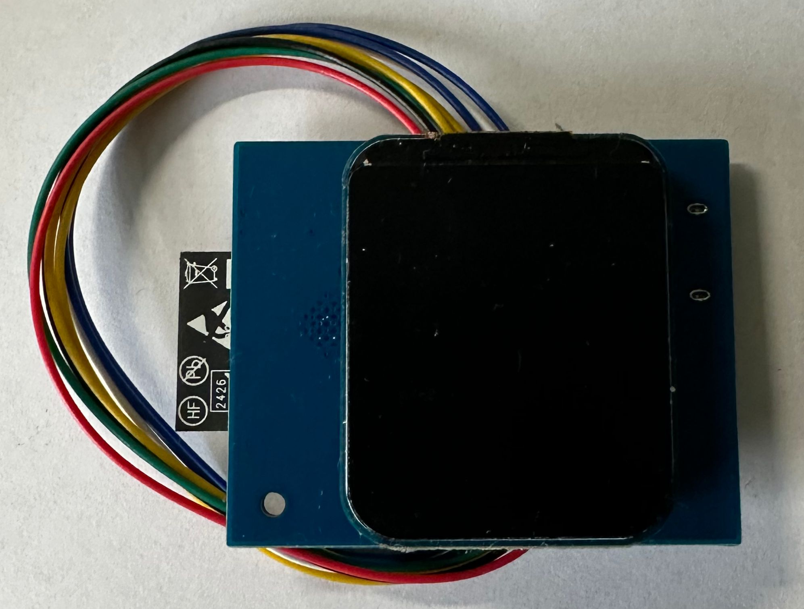

# YAHA

**Y**et **A**nother **H**ome **A**ssistant is a small configurable ESP32 Application visualizing the current weather on a 1.69 Inch LCD Screen. 

## Showcase

## Requirements
- **ESP-IDF Version**		: 5.2.1
- **LVGL Version**			: 8.3.11
- 1.69 inch **LCD Screen** using ST7789v2
- **ESP32**

## Installation Instructions
1. Install the specified version of ESP-IDF.
2. Add LVGL as a dependency:
	- Option 1:  Install it directly via the ESP-IDF dependency management.
	- Option 2: Manually download LVGL component and place it in your ESP-IDF installation directory. For example, add it under:
`frameworks/esp-idf-v5.2.1/components/`

## Config

### Set your target (Recommended ESP32-S3)
`idf.py set-target esp32-s3`

### Config Settings
`idf.py menuconfig`

#### Partition Table
Partition Table -> Single factory app (large) 

#### LVGL
Component config -> LVGL configuration -> Font usage -> Enable built-in Fonts -> Enable Montserrat 14 & 30

#### Wifi Config
WiFi Configuration -> WiFi SSID
WiFi Configuration -> WiFi Password

#### Openweather Config
API Configuration -> OpenWeatherAPI Key
API Configuration -> OpenWeather City

## Building & Flashing
After configuring the Environment you can start building:\
`idf.py build`

And flashing:\
`idf.py flash`

For debugging:\
`idf.py monitor`

## PCB
For a more slick design we also designed a custom PCB in KiCad, which integrates the LCD perfectly with the ESP32-S3. Four M2 screw holes perfectly fit with the [Waveshare LCD-module](https://www.waveshare.com/1.69inch-lcd-module.htm) for easy assembly. The files can be found under
 `/assets/pcb/`

### PCB Showcase

## License
This project is licensed under the MIT License. See the [LICENSE]() file for details.

